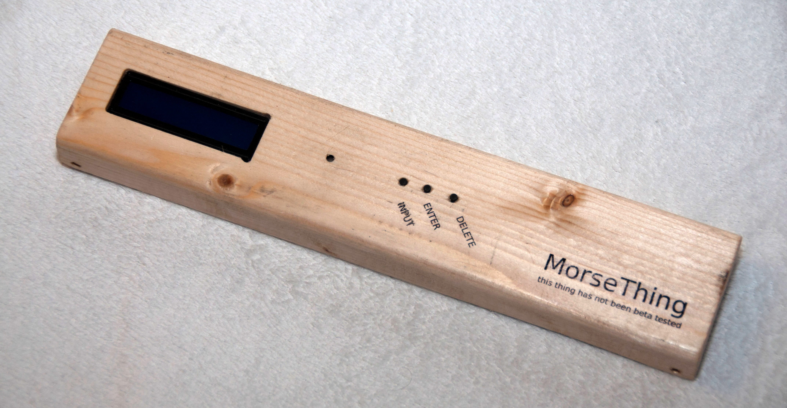

# MorseThing

The thing, which will test your Morse code knowledge. A prop used during [K-SCUK
2016](http://kscuk.fi.muni.cz/) night game.

# How to Use It?

There are 3 buttons, which allows user to enter a single word using Morse code.
When user enters a known word, the unit responses with a text and morse encoded
message.

To customize known words, simply modify `entries` array, which is a tuple of
trigger word, display message and message, which is beeped in morse code.

I am sorry, however there are no CAD files for mechanical design.
